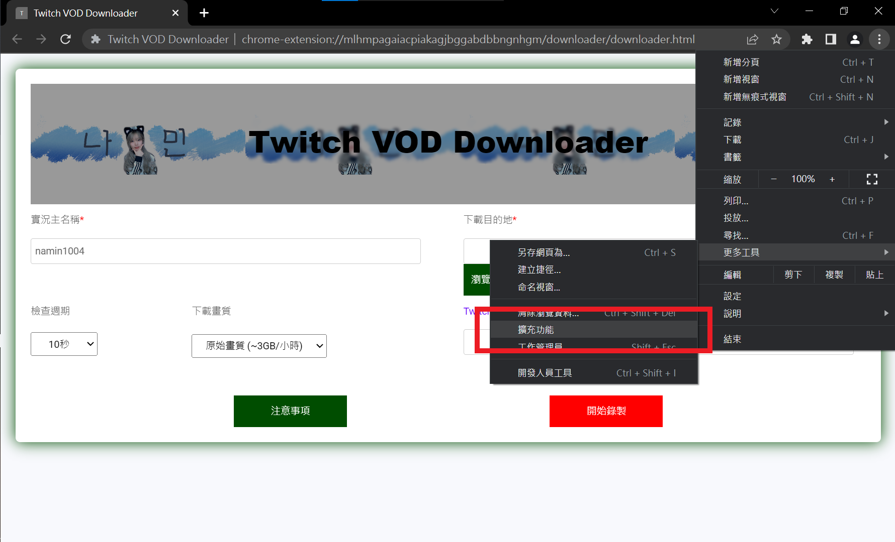
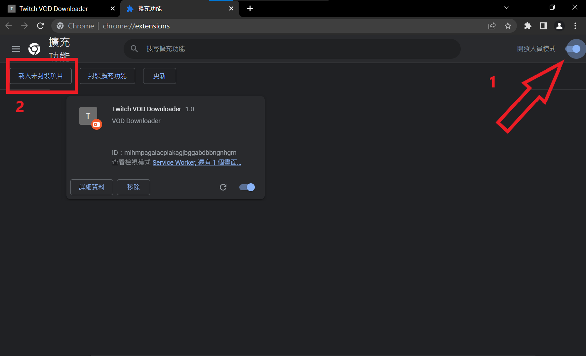
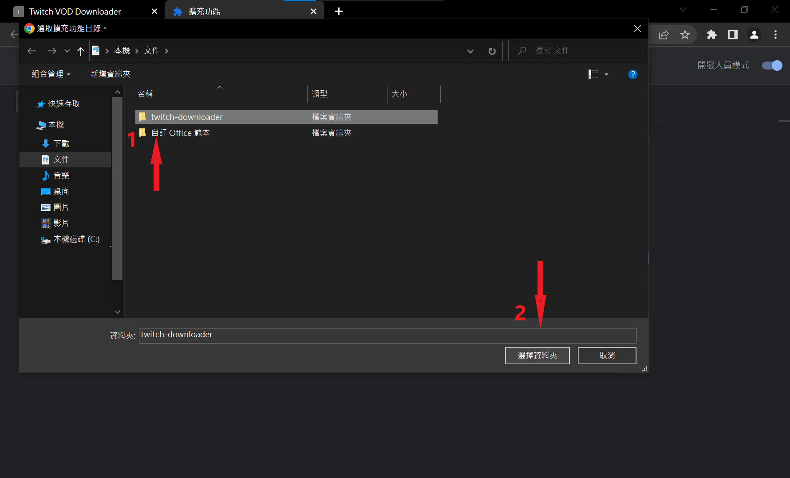
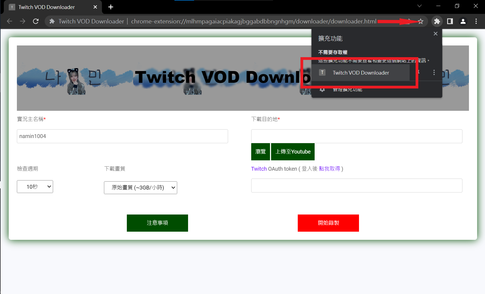
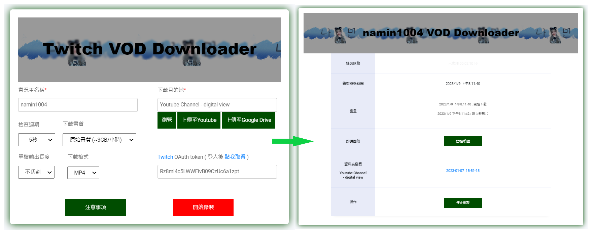
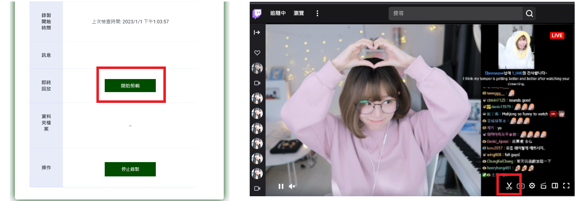
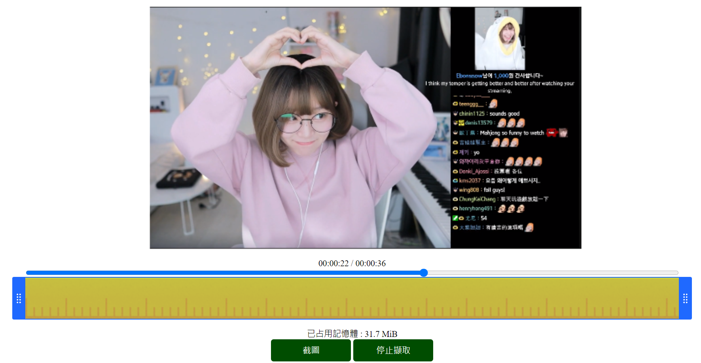
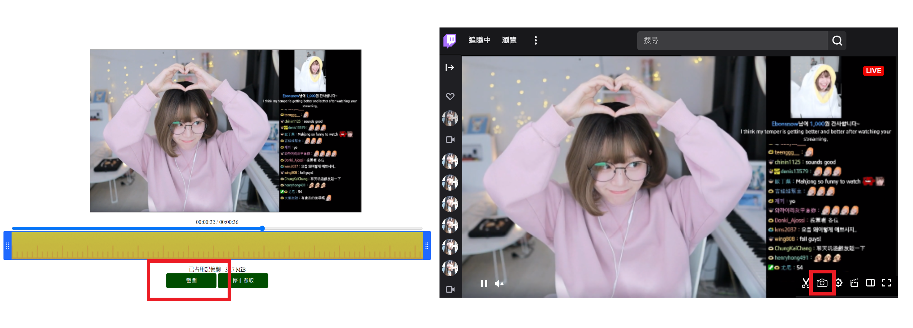

自動錄製Twitch VOD的一個Chrome擴充功能
* [安裝步驟](#安裝之前)
* [功能介紹](#功能介紹)
    * [錄製直播](#錄製直播)
    * [即時剪輯](#即時剪輯)
    * [直播截圖](#直播截圖)

## 安裝之前
1. 安裝[Chrome](https://www.google.com/intl/zh-TW/chrome/)或[Edge](https://www.microsoft.com/edge/launch/try-edge-now)瀏覽器

## 安裝步驟
1. [下載](https://github.com/Josh8712/Twitch-VOD-Downloader/releases/download/v0.0.2/twitch-downloader.zip) 資料並解壓縮
2. 開啟Chrome/Edge擴充功能管理

3. 開啟開發人員模式，載入未封裝項目

4. 選擇下載解壓縮資料夾位置

5. 開始使用並約讀注意事項

## 注意事項
1. 使用前請務必閱讀工具內的注意事項
2. 請自行測試並斟酌使用

## 功能介紹
### 錄製直播
設定自動錄製選項，開始錄製檢查直播狀態

### 即時剪輯
1. 進入剪輯頁面
    - 透過下載頁面
    - 透過Twitch播放器擴充選項
    
2. 停止影片擷取並設定剪輯範圍
    

### 直播截圖
- 透過剪輯頁面
- 透過Twitch播放器擴充選項
